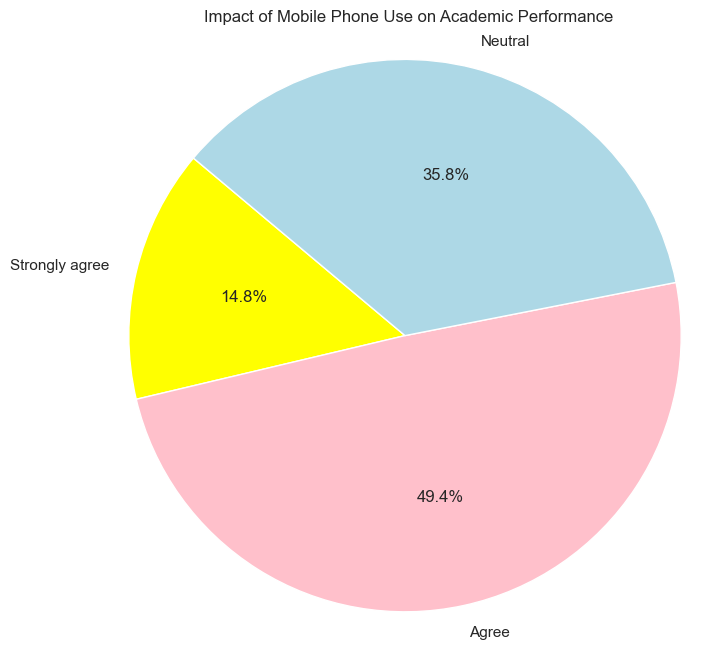
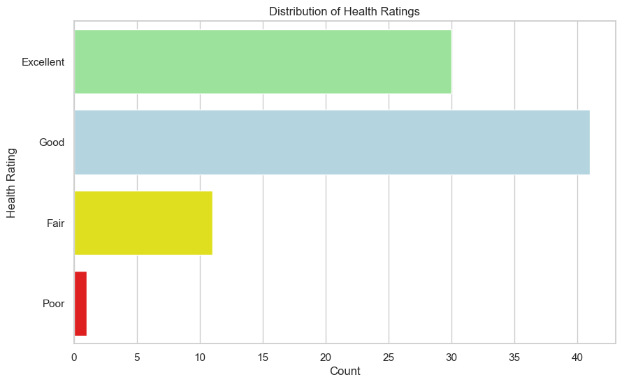

# Project Group 11

### Team Members

1. Laxmi Harika Bibireddy
2. Sai Harsha Chapala
3. Yashwanth Chowdary Kanaparthi
4. Chaitanya Kurati
5. Vamsidhar Reddy Yarrabelly

## Data Source:

**Dataset Link:** [Students Health and Academic Performance](https://www.kaggle.com/datasets/innocentmfa/students-health-and-academic-performance)

## Project Overview:

This project aims to explore how students' health impacts their academic performance using clustering techniques. By grouping students based on various health and academic features, we can gain insights into patterns and relationships within the data.

## Project Type

- **Type of Project:** Predictive
- **Learning Type:** Supervised learning
- **Methods:** Classification and regression

#### Relevant Domain Information (links to two or more articles that relate to your research question; one will most likely come from the link to the data)
1.https://researchgate.net/publication/377499021_Impact_of_Mobile_Phone_usage_on_School_Students'_Academic_Performance_SSAP_Insights_from_COVID_19 

2.https://www.ncbi.nlm.nih.gov/pmc/articles/PMC9651103/

3.https://www.sciencedirect.com/science/article/pii/S2451958821000622

## Files

- `data.csv`: The dataset with information about students' health and academic performance.
- `kddproject`: The main script for data preprocessing, clustering, and visualization.

## Libraries used

Ensure you have the following Python libraries installed:

- pandas
- numpy
- matplotlib
- seaborn
- scikit-learn

You can install them using pip:

pip install pandas numpy matplotlib seaborn scikit-learn

        
### Data Description

``The dataset includes the following columns:``

Names: Student names

Age: Student ages (in years)

Gender: Male/Female

Mobile phone: Do students own a mobile phone? (Yes/No)

Mobile Operating System: Type of mobile operating system used (e.g., Android, iOS, Other)

Mobile phone use for education: Do students use their mobile phone for educational purposes? (Sometimes/Frequently/Rarely)

Mobile phone activities: List of mobile phone activities used for educational purposes (e.g., online research, educational apps, email, online learning platforms)

Helpful for studying: Do students find mobile phone use helpful for studying? (Yes/No)

Educational Apps: List of educational apps used

Daily usages: Average daily time spent using mobile phone for educational purposes (in hours)

Performance impact: How does mobile phone use impact academic performance? (Agree/Neutral/Strongly agree)

Usage distraction: Does mobile phone use distract from studying? (During Exams/Not Distracting/During Class Lectures/While Studying)

Attention span: Has mobile phone use affected attention span? (Yes/No)

Useful features: What features of mobile phones are useful for learning? (e.g., Internet Access, Camera, Calculator, Notes Taking App)

Health Risks: Are students aware of potential health risks associated with excessive mobile phone use? (Yes/No/Only Partially)

Beneficial subject: Which subjects benefit most from mobile phone use? (e.g., Accounting, Browsing Material, Research)

Usage symptoms: Are students experiencing any physical or mental symptoms related to mobile phone use? (e.g., Sleep disturbance, headaches, Anxiety or Stress, All of these)

Symptom frequency: How often are symptoms experienced? (Sometimes/Never/Rarely/Frequently)

Health precautions: Are students taking precautions to mitigate potential health risks? (Taking Break during prolonged use/Using Blue light filter/Limiting Screen Time/None of Above)

Health rating: How would students rate their overall physical and mental health? (Excellent/Good/Fair/Poor)

## Steps  Performed in the Notebook:

``1. Load the Dataset``
The dataset is loaded from a CSV file into a pandas DataFrame for easy manipulation and analysis.

``2. Data Cleaning``
Replace Infinite Values: Any infinite values in the dataset are replaced with NaN to avoid errors in processing.
Handle Missing Values: Missing values in numeric columns are filled with the median value of each column to ensure the dataset is complete and consistent.

``3. Data visualizations``
To understand the data we have used different types of the visualizations like Distribution of the ages, Mobile phone ownership,Plotting frequency of mobile phone use for education,impact of mobile phone use on the academic performance,Distribution of the Health Ratings, performance impact vs Mobile Phone use for the education

``4. Convert Categorical Data``
 Range Conversion: Categorical ranges (e.g., '21-25') are converted to numeric values (e.g., midpoint of the range) to facilitate numerical  operations.
 One-Hot Encoding: Categorical variables are transformed into binary columns (0 or 1) to prepare the data for clustering.
 
``5. Encode Health Ratings Numerically``
The Health rating column is mapped to numeric values (e.g., 4 for 'Excellent', 1 for 'Poor') to integrate this feature into the clustering analysis.

``6. Standardize the Data``
The dataset is standardized to have a mean of 0 and a standard deviation of 1, ensuring all features contribute equally to the clustering process.

``7. Determine Optimal Number of Clusters``
Elbow Method: The optimal number of clusters is determined by plotting the sum of squared distances of samples to their cluster centers against the number of clusters. The point where adding more clusters results in diminishing returns is considered optimal.

``8. Apply KMeans Clustering``
KMeans clustering is applied using the optimal number of clusters, and each student is assigned to a cluster based on their feature values.

``9. Visualization``
Elbow Plot: This plot visualizes the results of the elbow method, showing how inertia (sum of squared distances) changes with the number of clusters.

Pairplot: This plot visualizes the clustering results, displaying how students are grouped based on features like Health rating and Age, with different clusters represented in different colors.

## How to Run the Code?

1.Ensure you have the required dependencies installed.
2.Place the dataset (data.csv) and the jupyternotebook (Kddproject) in the same directory.
3.click the run button on the jupyter notebook environment or in the 

The script will perform data preprocessing, apply clustering, and generate visualizations.

# Interpretation

The generated visualizations will help you understand how different features, such as health ratings and age, contribute to clustering students based on their data. This can provide insights into the relationship between students' health and their academic performance.

# Example visulaizations

## Data Preparation

- Replace Infinite Values: Any infinite values in the dataset are replaced with NaN to avoid errors in processing.
Handle Missing Values: Missing values in numeric columns are filled with the median value of each column to ensure the dataset is complete and consistent.

- Apply KMeans Clustering
  KMeans clustering is applied using the optimal number of clusters, and each student is assigned to a cluster based on their feature values.

- Visualization
Elbow Plot: This plot visualizes the results of the elbow method, showing how inertia (sum of squared distances) changes with the number of clusters.

- Pairplot: This plot visualizes the clustering results, displaying how students are grouped based on features like Health rating and Age, with different clusters represented in different colors.

